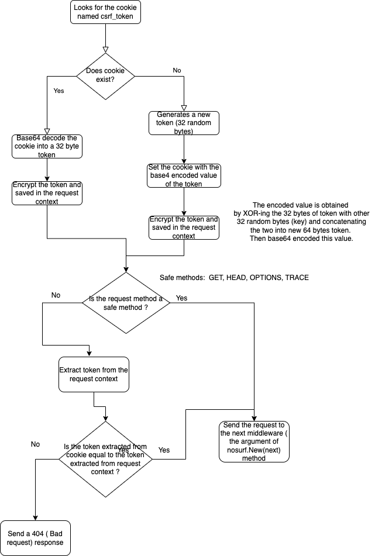
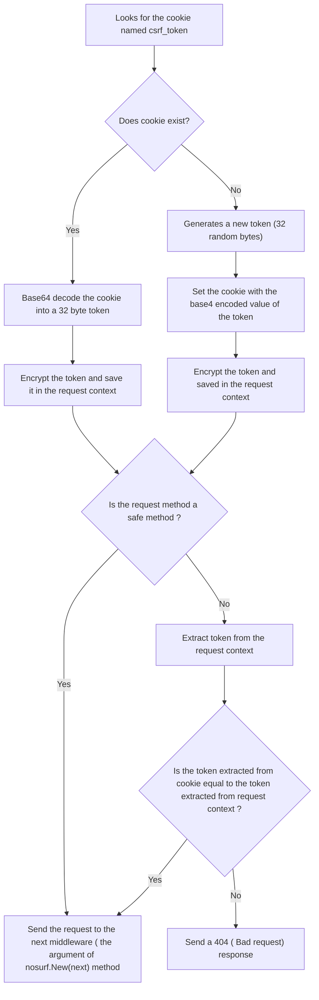

# Chapter 11. User authentication

## 11.2 Creating a user model

```mysql
CREATE TABLE users (
id INTEGER NOT NULL PRIMARY KEY AUTO_INCREMENT,
name VARCHAR(255) NOT NULL,
email VARCHAR(255) NOT NULL,
hashed_password CHAR(60) NOT NULL,
created DATETIME NOT NULL
);

ALTER TABLE users ADD CONSTRAINT users_uc_email UNIQUE (email);
```

## 11.3 User signup and password encryption

- We're not re-displaying the password if the form fails validations. This is because we don't want there to be [any risk](https://ux.stackexchange.com/questions/20418/when-form-submission-fails-password-field-gets-blanked-why-is-that-the-case) of the browser caching the plain-text password entered by the user.
- Validator: Matches regular expression

```
validator.go

func (v *Validator) Matches(value string, rx *regexp.Regexp) bool {
	return rx.MatchString(value)
}
```

- #### Email pattern recommended by the W#C and Web Hypertext Application Technology Working Group: [Here](https://html.spec.whatwg.org/multipage/input.html#valid-e-mail-address) or [here](https://www.w3.org/TR/2016/REC-html51-20161101/sec-forms.html#email-state-typeemail)

```
validator.go

// EmailRX Use the regexp.MustCompile() function to parse a regular expression pattern
// for sanity checking the format of an email address. This returns a pointer to
// a 'compiled' regexp.Regexp type, or panics in the event of an error. Parsing
// this pattern once at startup and storing the compiled *regexp.Regexp in a
// variable is more performant than re-parsing the pattern each time we need it.
var EmailRX = regexp.MustCompile("^[a-zA-Z0-9.!#$%&'*+\\/=?^_`{|}~-]+@[a-zA-Z0-9](?:[a-zA-Z0-9-]{0,61}[a-zA-Z0-9])?(?:\\.[a-zA-Z0-9](?:[a-zA-Z0-9-]{0,61}[a-zA-Z0-9])?)*$")

handlers.go

form.CheckField(form.Matches(form.Email, validator.EmailRX), "email", "This field must be a valid email address")
```

- #### In the solution, password encryption was implemented using bcrypt algorithm in the golang.org.x.crypto package

  - Import the latest version of the golang.org/x/crypto/bcrypt package

```
go get golang.org/x/crypto/bcrypt@latest
```

- Test encrypt

```
validator_test.go

func TestPasswordHashFunction(t *testing.T) {
	hash, err := bcrypt.GenerateFromPassword([]byte("my plain text password"), 12)
	if err != nil {
		t.Fatal("Encrypt error")
	}
	fmt.Println(string(hash), len(hash))
	// Result: $2a$12$EKbiojA0pFriBB5miZCzOuJGwan3IrqDzqj3DF7jQKo2P5NHikRTa 60
	hash2 := []byte(string(hash))
	err = bcrypt.CompareHashAndPassword(hash2, []byte("my plain text password"))
	if err != nil {
		t.Fatal("Comparison error")
	}
}

```

- [Bcrypt output format](https://blog.boot.dev/cryptography/bcrypt-step-by-step/):

$2a$12$EKbiojA0pFriBB5miZCzOuJGwan3IrqDzqj3DF7jQKo2P5NHikRTa
String contains 3 sections separated by $:

- First section 2a - hash algorithm identifier (len 3 bytes including $)
- Second section 12 - Cost factor ( 2^12 rounds of key expansions) (len 3 bytes including $)
- Third section: salt + hash (len 22 + 31 + 1 = 54 bytes, including $)

  - EKbiojA0pFriBB5miZCzOu 16-byte salt, base64 encoded to 22 characters
  - JGwan3IrqDzqj3DF7jQKo2P5NHikRTa 24 byte hash, base64 encoded to 31 characters
    Total length of output: 3 + 3 + 54 = 60 bytes
- A cost of 12 is a reasonable minimum, but if possible you should carry out load testing, and if you can set the cost higher without adversely affecting user experience then you should.

#### [MySQL's error codes](https://dev.mysql.com/doc/mysql-errors/8.0/en/server-error-reference.html) and how they are treated

## 11.4 User login

- In method userLoginPost, after authentication was succeeded, user the RenewToken() method on the current session to change the session ID

  - It's good practice to generate a new session ID when the authentication state or privilege levels changes for the user (e.g. login and logout operations).
  - After RenewToken() is call, when processing the response, the scs.SessionManager.LoadAndSave middleware will delete the previous record in the sessions database for the current user, create a new record and send a new cookie to the client. When deleting the session and creating a new one, this one will retain any data associated with the session.
  - It's good practice to do this before login to mitigate the risk of a **session fixation
    attack**. See [OWASP Session Management Cheat Sheet](https://github.com/OWASP/CheatSheetSeries/blob/master/cheatsheets/Session_Management_Cheat_Sheet.md#renew-the-session-id-after-any-privilege-level-change)
- How to check whether the hashed password and plain-text password provided match.

```
users.go
func (m *UserModel) Authenticate(email string, password string) (*User, error) {
	stmt := `SELECT id, name, hashed_password FROM users
				WHERE email = ?`
	u := &User{}
	err := m.DB.QueryRow(stmt, email).Scan(&u.ID, &u.Name, &u.HashedPassword)
	if err != nil {
		if errors.Is(err, sql.ErrNoRows) {
			return nil, ErrInvalidCredentials
		}
		return nil, err
	}

	// Check whether the hashed password and plain-text password provided match.
	// If they don't, we return the ErrInvalidCredentials error.
	err = bcrypt.CompareHashAndPassword(u.HashedPassword, []byte(password))
	if err != nil {
		if errors.Is(err, bcrypt.ErrMismatchedHashAndPassword) {
			return nil, ErrInvalidCredentials
		} else {
			return nil, err
		}

	}
	return u, nil
}

```

## 11.5 User logout

```
handlers.go

func (app *Application) userLogoutPost(w http.ResponseWriter, r *http.Request) {
	// Use the RenewToken() method on the current session to change the session
	// ID again.
	err := app.SessionManager.RenewToken(r.Context())
	if err != nil {
		app.serverError(w, err)
		return
	}
	// Remove the authenticatedUserID from the session data so that the user is
	// 'logged out'.
	app.SessionManager.Remove(r.Context(), "authenticatedUserID")
	// Add a flash message to the session to confirm to the user that they've been
	// logged out.
	app.SessionManager.Put(r.Context(), "flash", "You've been logged out successfully!")

	// Add a flash message to the session to confirm to the user that they've been
	// logged out.
	http.Redirect(w, r, "/", http.StatusSeeOther)
}
```

## 11.6 User authorization

- IsAuthenticated helper method

```
helpers.go

func (app *Application) isAuthenticated(r *http.Request) bool {
	return app.SessionManager.Exists(r.Context(), "authenticatedUserID")
}
```

- Update templateData struct and newTemplateData method

```
templates.go

type templateData struct {
...
	IsAuthenticated bool
}

helpers.go

func (app *Application) newTemplateData(r *http.Request) *templateData {
	return &templateData{
	...
		IsAuthenticated: app.isAuthenticated(r),
	}
}
```

- Add requireAuthentication middleware

```
middleware.go

func (app *Application) requireAuthentication(next http.Handler) http.Handler {
	return http.HandlerFunc(func(w http.ResponseWriter, r *http.Request) {
		// If the user is not authenticated, redirect them to the login page and
		// return from the middleware chain so that no subsequent handlers in
		// the chain are executed.
		if !app.isAuthenticated(r) {
			http.Redirect(w, r, "/user/login", http.StatusSeeOther)
			return
		}
		// Otherwise set the "Cache-Control: no-store" header so that pages
		// require authentication are not stored in the users browser cache (or
		// other intermediary cache).
		w.Header().Add("Cache-Control", "no-store")

		// And call the next handler in the cache
		next.ServeHTTP(w, r)
	})
}

```

- Note: The Cache-Control no-store response directive indicates that any caches of amy kind (private or shared) should not store this response. [See](https://developer.mozilla.org/en-US/docs/Web/HTTP/Headers/Cache-Control)
- Add protected routes

```
routes.go

func (app *Application) routes() http.Handler {
...
// Unprotected application routes using the "dynamic" middleware chain.
	dynamic := alice.New(app.SessionManager.LoadAndSave)

	router.Handler(http.MethodGet, "/", dynamic.Then(app.HomeHandler()))
	...

	// Protected (authenticated-only) application routes, using a new "protected"
	// middleware chain which includes the requireAuthentication middleware.
	protected := dynamic.Append(app.requireAuthentication)

	router.Handler(http.MethodGet, "/snippet/create", protected.ThenFunc(app.snippetCreate))
	...

	standard := alice.New(app.recoverPanic, app.logRequest, secureHeaders)
	return standard.Then(router)
}
```

- Change nav.tmpl

```
nav.tmpl

{{define "nav"}}
<nav>
    <div>
        <a href="/">Home</a>
        <!-- Toggle the link based on authentication status -->
        {{if .IsAuthenticated}}
            <a href="/snippet/create">Create snippet</a>
        {{end}}
    </div>
    <div>
        <!-- Toggle the link based on authentication status -->
        {{if .IsAuthenticated}}
            <form action="/user/logout" method="post">
                <button>Logout</button>
            </form>
        {{else}}
            <a href="/user/signup">Signup</a>
            <a href="/user/login">Login</a>
        {{end}}

    </div>
</nav>
{{end}}

```

- Check redirection to login with curl

```
curl -i -X POST https://lm58.tplinkdns.com/snippet/create

Response:
HTTP/2 303 
content-security-policy: default-src 'self'; style-src 'self' fonts.googleapis.com; font-src fonts.gstatic.com
location: /user/login
referrer-policy: origin-when-cross-origin
vary: Cookie
x-content-type-options: nosniff
x-frame-options: deny
x-xss-protection: 0
content-length: 0
date: Fri, 30 Sep 2022 15:05:07 GMT
```

- If you have a self-signed certificate, add -k (--insecure) option

```
curl -ki -X POST https://lm58.tplinkdns.com/snippet/create
```

- If you want to see the redirected page:

```
curl -i -L -X POST https://lm58.tplinkdns.com/snippet/create
```

## 11.7 CSRF protection

- Cross-site request forgery [Cheat Sheet](https://cheatsheetseries.owasp.org/cheatsheets/Cross-Site_Request_Forgery_Prevention_Cheat_Sheet.html)
- [CSRF attack explained](https://www.gnucitizen.org/blog/csrf-demystified/)
- [Login](https://stackoverflow.com/questions/6412813/do-login-forms-need-tokens-against-csrf-attacks) and [logout](https://stackoverflow.com/questions/6412813/do-login-forms-need-tokens-against-csrf-attacks) attacks

### Mitigations for the attacks

#### SameSite cookies

The cookie that are used for authentication (e.g. session cookie in alexedwards/scs package) sets SameSite attribute to Lax value. [See](https://cheatsheetseries.owasp.org/cheatsheets/Cross-Site_Request_Forgery_Prevention_Cheat_Sheet.html#samesite-cookie-attribute)

> By default the alexedwards/scs package that we’re using always sets SameSite=Lax on the
> session cookie. This means that the session cookie won’t be sent by the user’s browser for any
> unsafe cross-site requests (i.e. cross-site requests with the HTTP methods POST, PUT and
> DELETE).

> However, the SameSite attribute is still relatively new and only fully supported by 90% of browsers worldwide. So, although it’s something that we can (and should) use as a defensive
> measure, we can’t rely on it for all users.

#### Token-based mitigation

- Two most used packages for stopping CSRF attacks in Go web applications are gorilla/csrf and justinas/nosurf. The snippetbox web site uses [justinas/nosurf](https://github.com/justinas/nosurf)
- Install package

```
go get github.com/justinas/nosurf@v1
```

**Using the justinas/nosurf package**

1) Create a nosurf middleware function which uses a customized CSRF cookie with the Secure, Path and HttpOnly attributes set

```
func noSurf(next http.Handler) http.Handler {
	csrHandler := nosurf.New(next)
	csrHandler.SetBaseCookie(http.Cookie{
		HttpOnly: true,
		Path:     "/",
		Secure:   true,
	})
	return csrHandler
}
```

**Notes**:

- csrHandler is of type *CSRFHandler. CSRFHandler is a struct that implements Handler interface (ServeHTTP(ResponseWRite, *Request) method).
  When processing the request, it looks for the cookie named **csrf_token**
- if the cookie doesn't exist, it generates a new token (32 random bytes), set the cookie with the base64 encoded value of the token (44 characters) and add a value in the request context.
- this encoded value is obtained by XOR-ing the 32 bytes of token with other 32 random bytes (key) and concatenating the two into new 64 bytes token. Then base64 encoded this token.
- this value is saved in the context of the request in order to be accessed by other handlers in the chain, to be put as a hidden field in the form protected from an CSRF attack
- if the csrf_token exists in the request, it is base64 decoded in order to retrieve the 32 bytes token and then calculate a value as above from this token and add it to the request context.

  


2) Obtain the CSRF token from the request context, add field CSRFToken to the templateData struct and update newTemplateData method.

CSRF token is obtained from the request context like this:

```
// r *http.Request
nosurf.Token(r)
```
```
templates.go

type templateData struct {
	CurrentYear     int
	Snippet         *models.Snippet
	Snippets        []*models.Snippet
	Form            any
	Flash           string // Add a flash field to the templateData struct
	IsAuthenticated bool
	CSRFToken       string // Add a CSRFToken field
}

helpers.go

func (app *Application) newTemplateData(r *http.Request) *templateData {
	return &templateData{
		CurrentYear:     time.Now().Year(),
		Flash:           app.SessionManager.PopString(r.Context(), "flash"),
		IsAuthenticated: app.isAuthenticated(r),
		CSRFToken:       nosurf.Token(r), // Add the CSRF token.
	}
}
```

3) Put the token obtained from the request context into hidden field in the form.

```
<form action="/user/signup" method="POST" novalidate>
        <!-- Include the CSRF token -->
        <input type="hidden" name="csrf_token" value="{{.CSRFToken}}">
 ....
 </form>
```